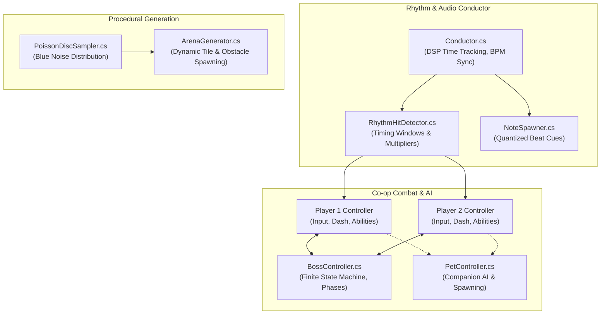

# 2-The-Beat 🎵⚔️ — 2-Player Split-Screen Co-op Rhythm Action

[](https://unity.com/)
[](https://docs.microsoft.com/en-us/dotnet/csharp/)
[](https://unity.com/srp/universal-render-pipeline)
[](https://github.com/dstathoulias/2-The-Beat)
[](https://github.com/dstathoulias/2-The-Beat)

A fast-paced **2-player split-screen couch co-op rhythm-action game** developed in **Unity 6** and **C#**. Players synchronize their movement, combat maneuvers, and special abilities to the beat of an adaptive soundtrack while battling multi-phase bosses in dynamically generated procedural arenas.

---

## Gameplay & Features

- **Split-Screen Couch Co-op:** True local cooperative gameplay where two players share the battlefield, coordinating strikes and complementary abilities.
- **Rhythm-Driven Combat Engine:** Attacks and abilities deal maximum damage and grant multipliers when executed in sync with the musical tempo.
- **Procedural Arena Generation:** Battlegrounds are algorithmically generated at the start of each run using mathematical **Poisson Disc Sampling**, ensuring perfectly spaced obstacle layouts and collectible distribution.
- **Dynamic Boss Encounters:** Challenging boss AI equipped with telegraphing attacks, phase transitions, and beat-quantized hazard patterns.
- **Synergistic Player Abilities:** Unlock and deploy specialized abilities including **Speed Boost**, **Double Damage**, and autonomous **Companion Pets** that assist during critical combat windows.

---

## System Architecture & Code Highlights



### 1. High-Precision Audio Conductor (`Conductor.cs`)
Music synchronization in Unity requires bypassing standard frame-rate delta times to eliminate audio drift. `2-The-Beat` leverages `AudioSettings.dspTime` to calculate exact audio clock positions:
- Calculates song position in beats: `songPositionInBeats = songPosition / secPerBeat`
- Evaluates hit windows (Perfect, Great, Good, Miss) inside `RhythmHitDetector.cs`
- Feeds real-time tempo data to UI meters and note cues.

### 2. Procedural Arena via Poisson Disc Sampling (`ArenaGenerator.cs`, `PoissonDiscSampler.cs`)
Rather than relying on static or pure pseudo-random placements (which result in unnatural clumping), the arena generation pipeline implements **Bridson's Poisson Disc Sampling algorithm** in 2D space:
- Guarantees minimum distance constraints between all spawned obstacles and pillars.
- Provides even blue-noise distribution of health pickups, ability orbs, and enemy spawns.
- Ensures playable paths and navigable arenas on every match generation.

### 3. Boss State Machine & Telegraphing (`BossController.cs`, `BossAnimationController.cs`)
- Modular finite-state machine governing boss behavior: `Spawning`, `Idle`, `TelegraphingAttack`, `ExecutingRhythmSweep`, `Stunned`.
- Health threshold event triggers driving visual phase transitions and increased BPM tempo.

---

## Controls & Input Mapping

Configured via Unity's **New Input System** (`Player Actions.inputactions`) supporting dual gamepads or shared keyboard:

| Action | Player 1 (Keyboard) | Player 2 (Keyboard) | Gamepad (P1 / P2) |
| :--- | :--- | :--- | :--- |
| **Move** | `W` / `A` / `S` / `D` | `Arrow Keys` | Left Analog Stick |
| **Rhythm Attack** | `Space` | `Keypad Enter` / `Right Ctrl` | `Button South` (A / Cross) |
| **Ability 1 (Speed Boost)** | `Left Shift` | `Keypad 0` | `Button West` (X / Square) |
| **Ability 2 (Double Damage)** | `E` | `Keypad 1` | `Button North` (Y / Triangle) |
| **Pause Game** | `Escape` | `Escape` | `Start / Options` |

---

## Technical Specifications

- **Engine:** Unity 6 LTS (`6000.4.3f1`)
- **Language:** C# 12 / .NET Standard 2.1
- **Render Pipeline:** Universal Render Pipeline (URP)
- **Input System:** Unity New Input System Package (`com.unity.inputsystem`)
- **UI Framework:** TextMeshPro & Unity UI Toolkit
- **Audio:** High-precision DSP-clocked multi-channel audio synchronization

---

## Getting Started (Development Setup)

### Prerequisites
- [Unity Hub](https://unity.com/download)
- **Unity Editor 6000.4.3f1 LTS** (installed via Unity Hub)

### Opening the Project
1. Clone the repository:
   ```bash
   git clone https://github.com/dstathoulias/2-The-Beat.git
   ```
2. Open **Unity Hub**, click **Add** > **Add project from disk**, and select the cloned `2-The-Beat` folder.
3. Ensure the editor version is set to **6000.4.3f1** (or compatible Unity 6 release).
4. Launch the project. Unity will automatically resolve package dependencies via `Packages/manifest.json`.
5. In the Project window, navigate to `Assets/Scenes/` and open `StartMenu.unity` or `Arena.unity`.
6. Press the **Play** button in the Unity Editor to test immediately.

---

## Project Structure

```text
2-The-Beat/
├── Assets/
│   ├── Animations/             # Character & boss skeletal animation clips
│   ├── Materials/              # URP materials & custom shield shaders
│   ├── Models/                 # 3D models and character meshes
│   ├── Music/                  # Rhythm audio tracks & SFX
│   ├── Prefabs/                # Spawner prefabs, boss prefabs, pickup prefabs
│   ├── Scenes/                 # StartMenu, Arena, VictoryScene
│   ├── Scripts/                # Core C# game architecture
│   │   ├── ArenaGenerator.cs       # Procedural map generation
│   │   ├── BossController.cs       # Boss AI & behavior state machine
│   │   ├── Conductor.cs            # DSP-clock audio engine & beat sync
│   │   ├── NoteSpawner.cs          # Dynamic beat queue spawning
│   │   ├── PlayerController.cs     # Co-op character controller & inputs
│   │   ├── PoissonDiscSampler.cs   # Mathematical sampling algorithm
│   │   └── RhythmHitDetector.cs    # Accuracy window evaluation
│   └── Settings/               # URP asset settings & input actions
├── Packages/                   # Unity Package Manager manifest
└── ProjectSettings/            # Engine & physics configuration
```

---

## Author & Contact

**Dimitris Stathoulias**  
- **GitHub:** [@dstathoulias](https://github.com/dstathoulias)  
- **Email:** [stath.jim2000@gmail.com](mailto:stath.jim2000@gmail.com)
